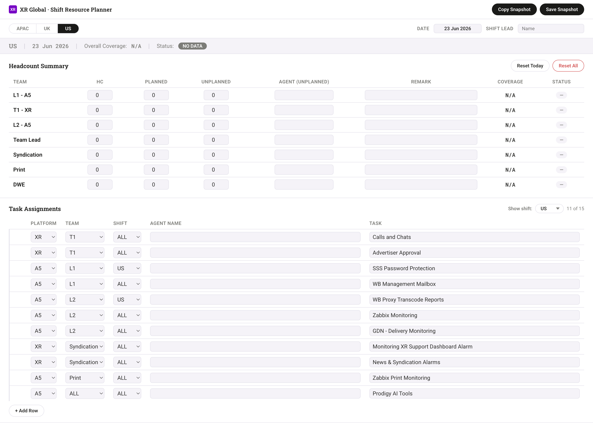

# XR Global — Daily Shift Resource Planner

A single-page HTML web application for managing daily shift resource planning across APAC, UK, and US shifts.

Replace your Excel-based workflow with a faster, visually clear, shareable tool — no backend, no installation.

## Features

- **Three-shift tabs** — APAC, UK, US with isolated state per shift
- **Headcount summary** — Track HC, planned/unplanned leave, agents, and remarks with auto-calculated coverage percentages
- **Reactive health banner** — Full-width strip showing overall coverage status (Healthy / Reduced / Critical / No Data)
- **Task assignments** — 15 pre-seeded tasks with inline editing, add/delete rows, and shift filtering
- **Snapshot export** — Save 2× retina PNG or copy to clipboard for handovers
- **Persistent** — All data saves automatically to `localStorage`

## Usage

1. Open `Resource Planner.html` in any modern desktop browser
2. Select a shift tab (APAC / UK / US)
3. Enter headcount numbers and leave values — coverage updates in real time
4. Assign tasks and agents
5. Use **Save Snapshot** or **Copy Snapshot** for shift handover

Works offline after first load (Google Fonts and html2canvas cached from CDN).

## Tech

- Single `.html` file — no build step, no npm, no backend
- Vanilla JavaScript + CSS
- `html2canvas` for PNG export
- `localStorage` for persistence
- Google Fonts: Roboto, Roboto Slab, Roboto Mono

## Spec

See [`PRD_XR_Shift_Resource_Planner.md`](PRD_XR_Shift_Resource_Planner.md) for the full feature specification.
